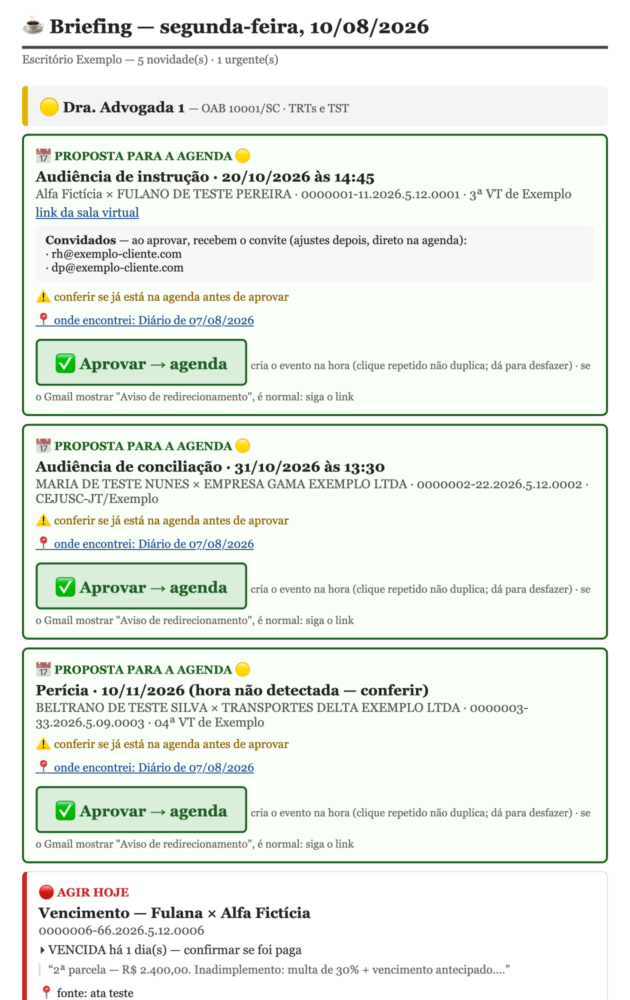

# Assistente Administrativo Jurídico

Assistente que, toda manhã, lê o Diário de Justiça (DJEN/Comunica CNJ), faz a
triagem do que chegou para cada advogado, monta um briefing por e-mail e, com
**um clique de aprovação**, coloca a audiência na Google Agenda e prepara o
aviso ao cliente. Construído para um escritório trabalhista real; **em produção
desde 12/08/2026**, com ciclo diário 100% automático.

**Regra que não se negocia:** o sistema *propõe*; a advogada *aprova*. Nenhuma
ação externa (agenda, e-mail a cliente) acontece sem aprovação humana explícita.

<p align="center"></p>

*Briefing de exemplo, gerado pela própria suíte com dados fictícios — o e-mail que a advogada recebe às 7h.*

## O que ele faz

```
 07:00  briefing montado (Gmail + Google Calendar + alertas de publicação)
 07:15  Apps Script envia o e-mail ao escritório
 07:45  coleta DJEN local (launchd) grava tudo no SQLite, deduplicado
 08:00  vigia-do-vigia: alarme se o briefing não chegou
 ▶ clique em "Aprovar" → evento na agenda (com os convidados do cliente)
                        + rascunho do aviso ao cliente na conversa do processo
```

Cada cartão do briefing é classificado por **regras explícitas** (🔴 agir hoje ·
🟡 esta semana · ⚪ informativo) e diz *quais sinais* o classificaram — nada de
"a IA achou que era urgente". Partes sob segredo de justiça nunca são expostas
além das iniciais; cópias da mesma intimação para vários destinatários viram um
único cartão.

## Stack

| Camada | Tecnologia |
|---|---|
| Runtime | **Node.js ≥ 22** (ESM), **zero dependências npm** — só módulos nativos, incluindo `node:sqlite` e `node:test` |
| Persistência | **SQLite** com tabelas `STRICT`, migrações versionadas, trigger de auditoria *append-only* e chaves de idempotência |
| Integrações | API pública do **DJEN/Comunica CNJ** (cliente próprio: paginação defensiva, retry, dedup por id); **Google Apps Script** na conta do escritório (Gmail + Calendar: envio, alarme, botão Aprovar, canal de entrega com token); **launchd** (macOS) para a coleta diária |
| Orquestração | Rotina agendada de **Claude** na nuvem monta o briefing das 7h com conectores Gmail/Calendar; o gerador local (`npm run briefing`) é a entrega reserva |
| Qualidade | `node --test`: **112 testes** (83 de fundação/ingestão/briefing + 29 dos spikes), 100% herméticos — sem rede, sem dado real, sem estado da máquina |
| Fase 0 | Spikes em Node e **Python** (limites de taxa do DJEN, DataJud, extração de texto de PDF com ordem de leitura) |

## Decisões de engenharia que valem a leitura

1. **Auditoria é append-only no banco** — trigger recusa `UPDATE`/`DELETE`; não
   depende da disciplina de quem chama.
2. **Idempotência é nossa, não do Google** — a reserva da chave grava *antes* da
   chamada externa; reprocessar a mesma ata não gera fato novo.
3. **Erro nunca vira "não há nada"** — coleta que falhou no meio volta
   `completo: false`; o briefing declara sua cobertura.
4. **Prazo não é adivinhado** — unidade ambígua lança; toda data carrega a
   memória de cálculo e a fonte legal (portaria, ato, artigo).
5. **Datas do fluxo principal são lidas, não calculadas** — o motor de prazos é
   uma segunda dupla de olhos permanente, marcado `requerConfirmacao`.
6. **Segredo não toca o disco do projeto** — Keychain do macOS; o log técnico
   nunca carrega teor de comunicação (sanitização recursiva).
7. **Triagem determinística, sem IA** — explicável cartão a cartão. IA fica
   reservada para a extração de atas (Fase 3), com citação verificada no texto.
8. **Calendários de 6 tribunais** (TRT12/3/6/9/15 e TST) semeados de portarias
   oficiais, entrada a entrada — e todos nascem `confirmado_em NULL` até
   validação humana. Regra descoberta e testada contra a tela do PJe:
   **publicação = disponibilização + 1 dia útil**, nunca o campo cru da API.

## Privacidade por construção

Este é um projeto que lê processo judicial; **dado real nunca entra no git**.
Identidade do escritório (advogados, OABs), contatos de clientes, token e URL
do App vivem em `dados/config.json`, fora do versionamento, e o código carrega
tudo de lá com exemplos fictícios como padrão. Atas, banco, briefings gerados,
logs e materiais de coleta são ignorados. Os nomes, processos e valores citados
em código, testes e documentação são fictícios (os números CNJ sintéticos têm
dígito verificador inválido de propósito). Um teste de **guarda de hermetismo**
lê os termos reais do config da máquina em tempo de execução e falha se algum
aparecer no repositório — a suíte policia o próprio sigilo.

> Materiais de trabalho com as advogadas (`coleta/`) e relatórios dos spikes
> (`spikes/relatorios/`) ficam apenas na máquina: contêm casos reais.

## Estrutura

```
src/core/      db, auditoria, idempotência, segredos, prazos/, briefing/ (triagem + HTML)
src/adapters/  cliente DJEN de produção
src/scripts/   gerar-briefing (CLI), cargas de feriados e obrigações
src/worker/    fila de jobs, heartbeat
tests/         suíte hermética (node:test)
spikes/        Fase 0 — código descartável + bibliotecas de extração de PDF
deploy/        Apps Script do escritório + launchd
```

## Rodar

```bash
npm test                      # 83 testes (fundação + ingestão + briefing)
npm run test:tudo             # + 29 dos spikes = 112
npm run briefing              # prévia do briefing local (não consome itens)
npm run briefing:oficial      # coleta DJEN + gera + marca como relatado
node src/core/diagnostico.mjs # estado do banco, auditoria, segredos e portões
```

Sem `npm install`: não há dependências. Node 22+ traz `node:sqlite` nativo.

## Limites conhecidos (medidos, não supostos)

- **O motor de prazos NÃO está aprovado** (`APROVADO_PELA_ADVOGADA = false`): os
  calendários estão carregados e o ramo `dias_uteis` reproduziu a conta do
  tribunal nos casos conferidos, mas a regra só vira chave com o gabarito
  calculado à mão pela advogada. Detalhe em
  [REGRA-DO-ESCRITORIO.md](src/core/prazos/REGRA-DO-ESCRITORIO.md).
- **O DJEN não vê tudo.** A primeira citação chega pelo Domicílio Judicial
  Eletrônico das empresas clientes, e a consulta por uma OAB não vê o que é
  dirigido à sócia. O sistema nunca diz "não há nada" — só "nada apareceu no
  que eu vejo", com a cobertura declarada.
- **Coleta só de IP residencial/comercial BR:** o DJEN bloqueia datacenters
  (testado com GitHub Actions e proxy de nuvem: 403 de borda). Por isso a
  coleta roda local.

## Roadmap

| Fase | Estado |
|---|---|
| 0 — Discovery e spikes | 🟢 concluída |
| 1 — Fundação (banco, auditoria, idempotência, prazos) | 🟢 concluída |
| 2 — Ingestão DJEN + briefing + botão Aprovar | 🟢 **em produção** |
| 3 — Extração de atas com IA e citação verificada | ⚪ não iniciada |

Especificação do produto e regras operacionais: [PRODUTO.md](PRODUTO.md).

## Licença

Todos os direitos reservados. O código está publicado para leitura e estudo —
portfólio — e não há, por enquanto, licença de uso, cópia ou redistribuição.
Uso comercial ou em outro escritório: sob consulta ao autor.

## Autor

Projetado, construído e operado por **Luigi** ([@luigiferrim](https://github.com/luigiferrim)) —
do discovery com as usuárias até o ciclo diário em produção.
